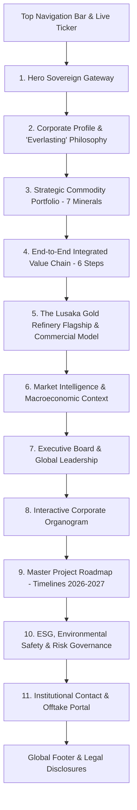
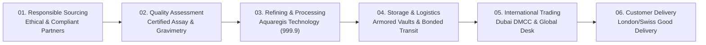
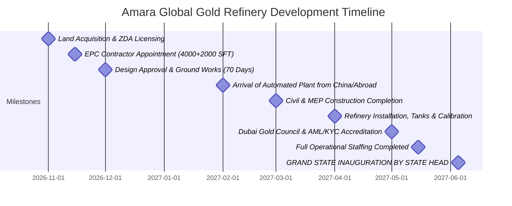

# AMARA GLOBAL RESOURCES LIMITED
## Enterprise Web Platform Architecture & UI/UX "Pro Max" Specification
**Document Version:** 1.0.0  
**Project:** Corporate Web Presence & Institutional Portal  
**Domain:** [www.amaraglobal-resources.com](https://www.amaraglobal-resources.com)  
**Tech Stack:** Native Modern HTML5, Advanced CSS3 (CSS Variables, Grid/Flexbox, Glassmorphism, GPU Keyframes), Vanilla ES6+ JavaScript  
**Authoritative Source:** *Amara Global Resources LTD – Company Profile (September 2026)*  

---

## 1. Executive Summary & Brand Positioning

### 1.1 Brand Identity & Etymology
* **Legal Entity Name:** Amara Global Resources Limited (affiliated with Amara Global Holdings Ltd)
* **Meaning of "AMARA":** *"Everlasting"* — embodying permanent value creation, ethical stewardship, intergenerational sustainability, and institutional resilience.
* **Primary Brand Taglines:**
  * *"Shaping Values – Building Legacies"*
  * *"Responsibly Sourced. Expertly Refined. Globally Delivered."*
  * *"More than a precious metal: Used from ancient times to modern technology, one of the rarest elements on earth, valued across science, industry, and culture."*
* **Core Geographic Axis:**
  * **Sourcing & Refining Hub:** Lusaka, Republic of Zambia (landlocked, resource-rich Southern African powerhouse along major transport corridors).
  * **Global Liquidity & Trading Desk:** Dubai, United Arab Emirates (DMCC / Dubai Gold Council standards).
  * **Regional Strategic Footprint:** Zambia, Tanzania, and Guinea-Conakry.

### 1.2 Core Pillars of the Enterprise
1. **Upstream Mining Assets:** 2,500 acres of proven mineral concessions with active mining permissions in Zambia.
2. **Midstream Precious Metals Refining:** 100 KG / Day capacity high-recovery automated Gold Refinery utilizing state-of-the-art **Aquaregis** hydrometallurgical technology in Lusaka, standardized toward Dubai, Swiss, and London Good Delivery bar benchmarks.
3. **Downstream Global Trading:** 2.4 Metric Tons / Per Annum physical gold trading pipeline routed through Dubai's institutional corridors.
4. **Diversified Critical Minerals:** Strategic trading and supply chains across Lithium (battery grade), Thermal Coal, Refined Fuel Oil, Industrial Dolomite, High-grade Manganese, and Limestone.
5. **Rigorous Compliance:** Built-in Anti-Money Laundering (AML), Know-Your-Customer (KYC), and Zambia Revenue Authority (ZRA) statutory alignment in collaboration with the Ministry of Economy, Central Bank, and the Zambia Development Agency (ZDA).

---

## 2. UI/UX "Pro Max" Design System

The visual identity expresses **Sovereign Industrial Authority and High-Finance Prestige**. The aesthetic blends the physical power of heavy mineral extraction with the immaculate precision of Swiss private banking and Dubai bullion exchanges.

### 2.1 Color Palette & Tokens (CSS Variables)

```css
:root {
  /* Surface & Background Neutrals */
  --bg-obsidian: #080a0e;          /* Deepest foundation black */
  --bg-graphite: #0f141c;          /* Secondary dark section background */
  --bg-slate-card: #141b26;        /* Elevated card background */
  --bg-glass: rgba(20, 27, 38, 0.72); /* Glassmorphism background */
  --border-subtle: rgba(255, 255, 255, 0.08);
  --border-gold-subtle: rgba(212, 175, 55, 0.22);
  --border-gold-strong: #d4af37;

  /* Imperial Metallics (Gold & Aurum) */
  --gold-100: #fdf8e8;             /* Gold highlight shimmer */
  --gold-300: #f3e5ab;             /* Light gold text accent */
  --gold-400: #ecc874;             /* Bright polished gold */
  --gold-500: #d4af37;             /* Core Imperial Metallic Gold */
  --gold-600: #b89025;             /* Deep metallic amber */
  --gold-700: #8a6d1c;             /* Antique bullion gold */
  --gold-gradient: linear-gradient(135deg, #f7e09e 0%, #d4af37 45%, #94721c 100%);
  --gold-gradient-text: linear-gradient(135deg, #ffffff 0%, #f3e5ab 35%, #d4af37 100%);
  --gold-glow: 0 0 35px rgba(212, 175, 55, 0.28);
  --gold-glow-intense: 0 0 50px rgba(212, 175, 55, 0.45);

  /* Typography Colors */
  --text-primary: #ffffff;         /* Optical pure white for high contrast */
  --text-secondary: #94a3b8;       /* Refined slate for descriptions */
  --text-muted: #64748b;           /* Metadata, subtle notes */
  --text-gold: #f3e5ab;            /* Accent headlines, tags */

  /* Functional & Commodity Badges */
  --badge-gold: #eab308;
  --badge-lithium: #06b6d4;        /* Electric cyan for battery mineral */
  --badge-coal: #64748b;           /* Slate grey */
  --badge-fuel: #f97316;           /* Energetic amber */
  --badge-dolomite: #a855f7;       /* Industrial violet */
  --badge-manganese: #3b82f6;      /* High-strength cobalt blue */
  --badge-limestone: #10b981;      /* Sustainable emerald */

  /* Motion & Elevation */
  --ease-out-expo: cubic-bezier(0.16, 1, 0.3, 1);
  --ease-in-out: cubic-bezier(0.4, 0, 0.2, 1);
  --transition-smooth: all 0.35s var(--ease-out-expo);
  --shadow-card: 0 20px 40px -15px rgba(0, 0, 0, 0.6);
  --shadow-elevation: 0 30px 60px -20px rgba(0, 0, 0, 0.8), 0 0 1px 1px rgba(212, 175, 55, 0.15);
}
```

### 2.2 Typography Hierarchy
* **Display / Hero / Section Titles:**
  * Font Family: `'Cinzel'`, `'Playfair Display'`, or `'Cinzel Decorative'` (Google Fonts serif with sovereign, timeless elegance).
  * Weights: 600 (SemiBold), 700 (Bold), 900 (Black).
  * Style: Uppercase letterspaced headers (`letter-spacing: 0.08em` to `0.15em`).
* **Body / Enterprise Copy / Data Labels:**
  * Font Family: `'Plus Jakarta Sans'`, `'Inter'`, or `'Montserrat'` (ultra-legible, geometric sans-serif engineered for modern screens).
  * Weights: 300 (Light), 400 (Regular), 500 (Medium), 600 (SemiBold).
  * Line Height: 1.65 for high readability.
* **Financial Data, Tickers, Assay Purity (999.9%):**
  * Font Family: `'JetBrains Mono'` or `'Space Mono'` (monospaced tabular numbers to emphasize metallurgical exactitude and fiscal transparency).

### 2.3 UX Micro-Interactions & Sensory Polish
1. **Interactive Glassmorphism Cards:** Real-time CSS backdrop blur (`backdrop-filter: blur(16px)`), with a radial gradient glow following cursor movement on desktop.
2. **Gold Foil Border Hover Effect:** 1px hairline border transitioning from subtle slate to radiant gold gradient with glowing ambient shadows on hover.
3. **Scroll-Driven Stagger Animations:** Fade-and-slide reveals (`IntersectionObserver`) for milestone timelines, executive organograms, and commodity cards.
4. **Live Commodities Ticker Bar:** Seamless infinite marquee scrolling showing live spot simulations, gold purity benchmark (`999.9 FINE GOLD`), refinery output capacity (`100 KG/DAY`), mining concession size (`2,500 ACRES`), and annual Dubai trade volume (`2.4 TONS/PA`).
5. **Interactive Gold Refining & Settlement Calculator:** Direct interactive widget allowing institutional miners and bullion dealers to enter gross ore/scrap weight (in KG or Troy Oz) and expected purity to calculate:
   * Pure Gold Yield (`Weight × Purity%`)
   * Immediate 50% Cash Advance post-assay
   * 6% Zambia Revenue Authority (ZRA) Tax withholding
   * 2% Custom Bonding & Insured Vaulting
   * Residual 50% Bank Transfer settlement within 5 banking days.

---

## 3. Detailed Website Sitemap & Page Structure

The platform can be implemented as a high-performance **Single-Page Application (SPA)** with deep-linked anchor routing and rich modal/drawer overlays, or a multi-page portal. The primary architecture contains 10 distinct, deeply detailed sections:



---

## 4. Section-by-Section Content & Functional Requirements

### Section 1: Sovereign Top Navigation & Live Market Ticker

#### Content & UI Components:
* **Brand Logo:** 3D Golden Infinity Symbol with Silver Ascending Arrow + Wordmark `"AMARA GLOBAL"` (AMARA in crisp platinum, GLOBAL in gold gradient) + Sub-tagline `"SHAPING VALUES - BUILDING LEGACIES"`.
* **Desktop Navigation Links:**
  * *Company* (`#about`)
  * *Commodities* (`#commodities`)
  * *Integrated Value Chain* (`#value-chain`)
  * *Lusaka Refinery* (`#refinery`)
  * *Market Insights* (`#market`)
  * *Leadership* (`#leadership`)
  * *Organogram* (`#organogram`)
  * *Project Roadmap* (`#timeline`)
  * *ESG & Risk* (`#esg`)
* **Call to Action (CTA) Button:** High-contrast metallic gold pill button: `"Partner With Us"` (triggers instant contact modal or scrolls to `#contact`).
* **Live Ticker Strip (Infinite Marquee beneath header):**
  * `GOLD ASSAY: 999.9% PURITY`
  * `REFINING CAPACITY: 100 KG / DAY`
  * `MINING ASSET: 2,500 ACRES ZAMBIA`
  * `DUBAI TRADING DESK: 2.4 TONS / PA`
  * `EXPORT VALUE GROWTH: +18% YOY`
  * `GLOBAL LITHIUM DEMAND: 2.5X BY 2030`
  * `SETTLEMENT: 50% ADVANCE CASH | 50% 5-DAY BANK TRANSFER`
  * `REGIONAL HUBS: LUSAKA (ZMB) | DUBAI (UAE) | CONAKRY (GIN) | DODOMA (TZA)`

---

### Section 2: Hero Sovereign Gateway

#### Visual Atmosphere:
* Background: Atmospheric, high-resolution dark industrial imagery of illuminated modern refinery tanks, molten gold pouring, and African geological aerial panoramas with an obsidian gradient overlay.
* Floating Particle/Glow Effect: Subtle gold dust micro-particles rendered via HTML5 `<canvas>` or lightweight CSS keyframes.

#### Typography & Copy:
* **Over-title:** `AMARA GLOBAL RESOURCES LIMITED | LUSAKA, ZAMBIA`
* **Hero Headline (H1):**
  ```html
  <h1>MINERALS &amp; <span class="text-gold-gradient">METALS</span></h1>
  <p class="hero-tagline">Responsibly Sourced. Expertly Refined. Globally Delivered.</p>
  ```
* **Lead Narrative:**
  > *"Uniting Africa’s monumental mineral wealth with institutional refining precision and world-class international trading corridors. From 2,500 acres of proven reserves in Zambia to our 100 KG/day Aquaregis gold refinery and multi-ton Dubai trading desk, Amara Global bridges sovereign resources with global capital."*
* **Primary Key Performance Indicator (KPI) Bar (4-Card Glass Metric Cluster):**
  1. **2,500 Acres:** Proven Concessions with Active Mining Permission in Zambia.
  2. **100 KGs / Day:** High-Purity (999.9) Gold Refinery Processing Capacity in Lusaka.
  3. **2.4 Tons / PA:** Physical Bullion International Trading Pipeline in Dubai.
  4. **7 Strategic Commodities:** Gold, Lithium, Coal, Fuel Oil, Dolomite, Manganese, Limestone.
* **CTAs:**
  * Primary: `"Explore Our Operations"` (Smooth scroll to `#refinery`)
  * Secondary: `"Institutional Sourcing & Offtake"` (Opens Inquiry Modal)

---

### Section 3: Company Overview & "Everlasting" Philosophy

#### Strategic Storytelling:
* **The Etymology:**
  > *"AMARA means 'EVERLASTING.' It signifies an unyielding commitment to perpetual growth, generational sustainability, and enduring value for our host nations, mining partners, clients, and workforce."*
* **Core Philosophy Points:**
  * **Global Expertise Meets Local Insight:** Former C-suite international bankers and African governance architects combining forces to unlock deep sovereign resource value.
  * **Emerging Economic Leadership:** Capitalizing on Zambia's peaceful representative democracy, +18% export growth, and strategic geographic connectivity bordering 8 African nations.
  * **End-to-End Governance:** Operating with total transparency, AML/KYC adherence, and alignment with the Zambia Development Agency (ZDA), Bank of Zambia, and Dubai Gold Council.
* **Geographic Feature Spotlight: "About Zambia – The Heart of African Mineral Wealth"**
  * *Peace & Stability:* A peaceful constitutional republic since 1964; known as one of Africa's safest, most welcoming nations.
  * *Geographical Anchor:* Landlocked hub bordered by 8 countries, centered along the historic Copperbelt-Lusaka-Livingstone infrastructure corridor.
  * *Economic Engine:* Driven by vast geological riches, major copper, gold, and battery mineral deposits, and the iconic Zambezi River power systems.

---

### Section 4: Strategic Commodity Portfolio (The 7 Pillars)

An interactive, multi-tab card showcase displaying the 7 distinct commodities documented in Slide 4 & 5 of the profile:

| Commodity | Primary Industrial Focus | Profile Specification & Market Function |
| :--- | :--- | :--- |
| **1. GOLD (Au)** | Precious Metal & Monetary Reserve | High-purity 999.9% hydrometallurgical refining, doré intake, and global bullion export to Dubai, Swiss, and London standards. |
| **2. LITHIUM (Li)** | Energy Transition & EV Battery Materials | Strategic sourcing of spodumene/pegmatite deposits meeting projected **2.5x global demand growth** by 2030. |
| **3. COAL (Thermal)** | Base-Load Power & Heavy Metallurgy | Thermal coal supply catering to expanding domestic Zambian and regional Southern African energy producers. |
| **4. FUEL OIL** | Industrial Process Energy | Direct trading and supply of refined heavy fuel oils for mining machinery, kilns, and regional manufacturing plants. |
| **5. DOLOMITE** | Fluxing & Industrial Chemistry | High-grade calcium magnesium carbonate supply essential for regional steel manufacturing and cement smelting. |
| **6. MANGANESE (Mn)** | Essential Alloy & Battery Cathodes | Critical metallurgical alloy component with robust international demand across infrastructure and clean-tech manufacturing. |
| **7. LIMESTONE (CaCO3)** | Construction, Agriculture & Flotation | Foundational mineral inputs for agricultural soil conditioning, regional infrastructure development, and lime processing. |

#### UI Features:
* **Filter Tabs:** `All`, `Precious Metals`, `Critical Battery Minerals`, `Energy Commodities`, `Industrial Minerals`.
* **Card Interactivity:** Clicking any card opens an in-depth modal highlighting extraction grade, standard packaging, supply capacity, and transport logistics.

---

### Section 5: The Integrated 6-Stage Business Model

An interactive visual pipeline detailing the end-to-end value chain from mine head to international delivery (Slide 5):



1. **Step 1: Responsible Sourcing** — Ethical, compliant, and sustainable sourcing from trusted mining partners across Zambia, governed by strict ESG verification.
2. **Step 2: Quality Assessment** — Rigorous spectroscopic, fire assay, and density grading to ensure uncompromised international standards prior to processing.
3. **Step 3: Refining & Processing** — Advanced **Aquaregis** hydrometallurgical processing maximizing recovery yield, extracting impurities, and casting 999.9 fine bullion bars.
4. **Step 4: Storage & Logistics** — High-security armored compound, bonded customs escort, secure warehousing, and seamless international air freight logistics.
5. **Step 5: Regional & International Trading** — Strategic institutional distribution desk headquartered in Dubai connecting African physical supply to major Swiss, London, and Asian bullion banks.
6. **Step 6: Customer Delivery** — Long-term sovereign and institutional offtake agreements built on verified provenance, punctual delivery, and fiscal trust.

---

### Section 6: Flagship Project — The Lusaka Gold Refinery

Detailed architectural, technological, and commercial specifications for Amara's central industrial facility (Slides 18, 19, 20, 21):

#### 6.1 Facility Technical Parameters
* **Location:** Lusaka, Republic of Zambia (Secured on long-term lease under the patronage of the Zambia Development Agency - ZDA).
* **Total Land Area:** 13,000 Square Feet (SFT).
* **Refinery Built-Up Area (BUA):** 10,000 Square Feet (SFT).
* **Executive Office Area:** 2,000 Square Feet (First Floor / Mezzanine).
* **Building Structure:** 6.5-Meter ceiling clearance height; Ground + Mezzanine (G+M / G+1) reinforced construction.
* **Security Cordon:** Closed perimeter barrier with round-the-clock armed security checkpoints, compartmentalized vaults, biometric access controls, and full-spectrum CCTV surveillance.
* **Technology:** Fully automated closed-loop **Aquaregis** chemical refining plant with industry-leading recovery rates and environmentally filtered acid scrubbing.
* **Standardization Target:** Formulated to satisfy **DUBAI, SWISS, and LONDON Good Delivery** specifications.

#### 6.2 Throughput & Scalability
* **Design Nameplate Capacity:** **100 Kilograms / Day** of refined gold.
* **Initial Production Ramp:** Commencing at **50 KGs per week (200 KGs per month)** under signed supply commitments with two premier mining corporations.
* **Supply Chain Guarantee:** Spearheaded by Chairman Robert Penney's four-decade relationships with Zambian artisanal and commercial mining consortiums.

#### 6.3 Commercial Trading & Settlement Matrix (Interactive Tool)
The profile establishes a transparent, rapid-settlement trade model designed to attract domestic and regional miners:

```
[Metal Intake at Refinery]
       │
       ▼
[Assay & Chemical Refining to 999.9% Purity]
       │
       ├───────────────────────────────────────────────┐
       ▼                                               ▼
[Immediate Advance Payment]                    [Deductions & Statutory]
  • 50% Disbursed in CASH upon purity assay      • 6% Zambia Revenue Authority (ZRA) Tax
                                                 • 2% Insurance & Custom Bonding Fee
                                               │
                                               ▼
                                       [Residual Settlement]
                                         • 50% Residual disbursed within 5 days
                                           via secure Bank Wire Transfer
```

* **Interactive Calculator Widget UI:**
  * Input Slider: Gold weight (e.g., `10.0 KG`)
  * Input Slider: Estimated raw doré purity (e.g., `85.0%`)
  * Market Spot Price Feed selector (USD / ZMW / AED)
  * Real-time Breakdown:
    * *Pure Gold Yield:* `8.50 KG (999.9 Purity)`
    * *Total Gross Value ($)*
    * *50% Instant Cash Disbursal ($)*
    * *6% ZRA Statutory Tax Withholding ($)*
    * *2% Insured Custody & Custom Bond ($)*
    * *50% Wire Transfer Disbursed within 5 Banking Days ($)*

---

### Section 7: Market Context & Macroeconomic Dynamics

Data-driven dashboard showcasing Zambia's compelling economic indicators (Slide 8 & 9):

* **+18% Year-over-Year Growth:** Zambia’s total mineral exports valuation expansion.
* **+16% Year-over-Year Increase:** Volume of physical mineral exports dispatched via transport corridors.
* **2.5X Demand Multiplier:** Projected global surge in lithium demand by 2030, driven by EV batteries and stationary grid storage.
* **Rising Regional Energy Demand:** Power deficits in Southern/Central Africa fueling rapid offtake for thermal coal and refined industrial fuel oils.
* **Strategic Growth Outlook:**
  1. Expanding lithium processing capacity to supply battery gigafactories.
  2. Diversifying thermal coal and fuel oil supply to regional power plants.
  3. Value-added domestic processing of manganese and dolomite before export.
  4. Strengthening pan-African supply chain resilience and local value addition.

---

### Section 8: Board of Directors & Global Leadership

Full executive bios highlighting world-class institutional pedigree (Slides 22, 23, 24):

#### 1. Robert A. Penney — Non-Executive Chairman
* *Background:* Qualified Chartered Accountant originally from Ireland (formerly PKF Chartered Accountants). Over **40 years of continuous governance and financial leadership in Zambia**.
* *Presidential Advisory:* Had the distinct privilege of working directly with two Zambian Presidents: **Dr. Kenneth Kaunda** and **Rupiah Banda**.
* *High-Level Public Roles:*
  * Former Chairman of the **Zambian Development Agency (ZDA)**.
  * Chairman of Lusaka’s Infrastructure Committee.
  * Deputy Chair of Mayor’s Finance Committee in Lusaka.
  * Trade Consultant for *Córas Tráchtála* (Irish Enterprise Board) for Zambia, directing Irish investments and bilateral trade.
  * Guest Lecturer at Wake Forest University (NC, USA) for MBA students.
  * President & Trustee of the Children of Africa Foundation; Honorary Life Vice President of Lusaka Golf Club (10-year Chairman of Zambia Open International Golf Tournament - Sunshine Tour).

#### 2. Jayessh Bharaathan — CEO & Group Managing Director
* *Background:* Founder of Amara Global Holdings Ltd. Former C-suite international banker, high-stakes dealmaker, and institutional architect with over **32 years of global experience** commanding multi-million-dollar capital ventures across the Middle East, Asia, and Africa.
* *Banking Pedigree:* Senior executive tenures at **Citibank, ABN AMRO, Emirates NBD, and FirstRand Banking Group**.
* *Asset Management & Private Equity:* Senior Vice President (Middle East & India) at **Forsyth Partners** (UK asset manager with >$4.5 Billion AUM); Executive Director at FirstRand Banking Group masterminding cross-border funds for the Indian economy; Executive Director at Channel Capital Partners LLC; CEO & Chief Strategist at Clover Bank'e Investments.
* *Enterprise Scale:* CEO & Group Managing Director of Electrolux Commercial Services; strategic advisor to corporate boards and the **Private Office of H.E. Sheikh Tariq Bin Khalid Al Qassimi**.
* *Thought Leadership:* Keynote speaker at global forums including the World Finance & United Exchange Summit, Overseas Private Investor Forum in Liaoning (China), and Auckland University of Technology (AUT, New Zealand).

#### 3. Dayakara Shetty (C.A.) — Chief Financial Officer
* *Background:* Seasoned Chartered Accountant with over **30 years of strategic financial administration, corporate governance, and treasury management** across the UAE and India.
* *Scale & Track Record:* Managed full-cycle financial operations for enterprises generating revenues up to **AED 150 Million**.
* *Core Specialisms:* Project costing, tender management, revenue recognition, trade finance (LC & Bank Guarantee administration), and multi-jurisdictional M&A due diligence.
* *ERP & Operations:* Proven architect of enterprise ERP deployments (Microsoft Dynamics Axapta, Oracle) across Oil & Gas, Marine Engineering, Manufacturing, and Facility Management.

#### 4. Rachita Bhat — Director Operations
* *Background:* Results-driven executive with over **18 years of leadership** across business development, marketing, and cross-border operational infrastructure in the aviation, IT, catering, and hospitality sectors.
* *Brand & Market Strategy:* Specialist in multi-channel brand positioning, international client retention, and establishing turnkey operational infrastructure for complex ventures.
* *Governance & Delivery:* Harmonizes regulatory compliance with operational delivery models, fostering high-performance cross-functional teams and sovereign stakeholder relationships.

---

### Section 9: Interactive Corporate Organogram

A visual, expanding organizational tree detailing the company hierarchy from the Board down to the plant floor (Slide 25):

```
                       [ BOARD OF DIRECTORS ]
         Robert Penney | Jayessh Bharaathan | Rachita Bhat | Independent Director
                                  │
                                  ▼
                      [ Jayessh Bharaathan ]
                   CEO & Group Managing Director
                                  │
        ┌─────────────────────────┴─────────────────────────┐
        ▼                                                   ▼
[ Trading Operations (Dubai) ]              [ Refinery Operations (Zambia) ]
  • Dayakara Shetty (CFO)                     • Dayakara Shetty (CFO)
  • Rachita Bhat (Dir Operations)             • Sadiq (General Manager - Refinery)
                                              • Tarun Verma (Technical Manager - Refinery)
                                              • Rachita Bhat (Director Operations)
                                                            │
                                  ┌─────────────────────────┼─────────────────────────┐
                                  ▼                         ▼                         ▼
                         [ SECURITY COMMAND ]      [ ADMINISTRATION & HR ]   [ TECHNICAL & REFINERY ]
                         • Head Security Officer   • HR Officer              • Tarun Verma (Tech Mgr)
                         • Armed Guard (Day)       • Accountant Refinery     • Refinery Supervisor
                         • Armed Guard 1 (Night)   • Receptionist            • Mint & Cast Techs (4)
                         • Armed Guard 2 (Night)   • Office Assistant        • Lab Assay Technician
                         • Armed Guard 3 (Night)                             • Refinery Technicians (8)
                                                                             • Refinery Handyman
                                                                             • Plant Cleaner
```

#### UI Implementation:
* Implemented as an interactive, zoomable SVG or CSS Flexbox Tree.
* Hovering on any role highlights its direct reporting lines and displays role count, key responsibilities, and operational division.

---

### Section 10: Master Project Roadmap (Timelines 2026 – 2027)

Interactive visual milestone stepper tracing the development from land acquisition to state inauguration (Slide 26):



| Date | Phase / Milestone | Profile Details & Operational Deliverables |
| :--- | :--- | :--- |
| **Nov 2026** | **Land Acquisition & Licensing** | Securing long-term lease for 13,000 SFT land plot from the Zambia Development Agency (ZDA); obtaining sovereign refining & export licenses. |
| **Nov 2026** | **Contractor Onboarding** | Appointment of vetted local civil/MEP contractor for the construction of the 10,000 SFT refinery and 2,000 SFT first-floor office block. |
| **Dec 2026** | **Groundbreaking & Civil Works** | Engineering design approval, excavation, foundation laying, and G+1 structural envelope (70 calendar days to structural completion). |
| **Feb 2027** | **Plant Import & Arrival** | Delivery of specialized automated Aquaregis refining plant, acid neutralization units, tanks, and furnaces on-site. |
| **Mar 2027** | **Construction Completion** | Civil, MEP, electrical sub-stations, and high-security cordon barriers finalized and inspected. |
| **Apr 2027** | **Installation & Testing** | Mounting of equipment, acid pipelines, exhaust scrubbers, bullion casting carousels, assay laboratory spectrometers, and initial trial runs. |
| **May 2027** | **Accreditation & Staffing** | Quality verification and standardization by Dubai Gold Council; AML/KYC statutory compliance cleared with Ministry of Economy and Central Bank; full 30+ person team onboarded. |
| **05 Jun 2027** | **★ State Inauguration** | **Official Grand Ribbon-Cutting and Inauguration Ceremony by the State Head of the Republic of Zambia.** |

---

### Section 11: ESG, Environmental Safety & Risk Mitigation Matrix

#### 11.1 ESG & Community Impact Framework (Slide 6)
* **Responsible Sourcing:** Ethical supplier onboarding, non-conflict certification, and supply chain provenance verification.
* **Worker Health & Safety:** Uncompromising "Zero Harm" safety culture, continuous hazard prevention protocols, full PPE compliance, and emergency drill regimens.
* **Environmental Controls:** Comprehensive environmental management systems protecting Zambian land, water tables, and natural biodiversity.
* **Emissions & Circular Waste:** Neutralization of hydrometallurgical effluents, closed-circuit Aquaregis recycling, and particulate scrubbing.
* **Local Employment & Skills Transfer:** Dedicated training initiatives upskilling Zambian technicians, metallurgists, and security personnel.
* **Community Engagement:** Proactive stakeholder dialogue investing in local education, healthcare, and infrastructure development.
* **Transparent Governance:** Zero-tolerance anti-corruption posture, annual third-party audits, and strict AML/CFT regulatory adherence.

#### 11.2 Institutional Risk Management Matrix (Slide 7)
An interactive tabbed risk matrix showcasing executive preparedness:

| Key Risk Area | Management & Governance Response |
| :--- | :--- |
| **Commodity Price Volatility** | Dynamic hedging programs, real-time market intelligence feeds, and diversified mineral exposure across 7 distinct commodities. |
| **Supply Continuity** | Long-term offtake agreements with vetted mining houses; direct access to artisanal networks via Chairman Robert Penney’s 40-year local standing. |
| **Logistics & Border Risk** | Pre-cleared bonded transport corridors, vetted international freight forwarding partners, and proactive multi-agency customs liaisons. |
| **Assay & Quality Assurance** | Triplicate laboratory testing (gravimetric, fire assay, ICP spectrometry) in certified facilities before metal transfer. |
| **Regulatory & Sovereign Compliance** | Deep alignment with Zambian statutory bodies (ZDA, ZRA, Ministry of Mines, Central Bank) with perpetual internal audit checks. |
| **Foreign Exchange (FX) Exposure**| Dual-currency treasury structuring (USD / ZMW / AED), systematic forward contract hedging, and disciplined cash conversion. |
| **Counterparty Risk** | Comprehensive institutional KYC/AML due diligence, conservative credit limits, and irrevocable Letters of Credit (LC). |

---

### Section 12: Partnership Portal & Global Contact

#### Direct Contact Channels (Slide 27):
* **Official Corporate Email:** `GM@amaraglobal-resources.com`
* **Direct Executive Phone:** `+260 979 788 406`
* **Official Web Domain:** `www.amaraglobal-resources.com`
* **Refinery Facility:** Lusaka Heavy Industrial Area, Lusaka, Republic of Zambia
* **Global Trading Desk:** Dubai Multi Commodities Centre (DMCC), Dubai, United Arab Emirates

#### Interactive Intake Portal Form:
* **Form Fields:**
  * Full Name & Corporate Title
  * Organization / Institutional Entity Name
  * Inquirer Category (Selector: *Mining Producer / Doré Seller*, *International Bullion Buyer*, *Lithium/Industrial Mineral Offtaker*, *Financial Institution / Investor*, *Regulatory / Government Official*)
  * Volume & Commodity of Interest (e.g., *Gold Doré - 50 KG/month*, *Battery Grade Lithium*, *Thermal Coal*)
  * Country / Operational Jurisdiction
  * Message / Specification Details
* **Features:** Client-side validation, instant confirmation modal, auto-reply trigger simulation.

---

## 5. Technical Implementation Architecture

### 5.1 Clean Directory & File Layout
The platform is built strictly with modern native web standards—no heavy npm build chains, bloated node_modules, or runtime dependencies required:

```
amaraglobal-website/
├── index.html                   # Master semantic HTML5 document
├── css/
│   ├── main.css                 # Master styles, reset, CSS variables, typography
│   ├── layout.css               # Navigation, hero, grid systems, responsive breakpoints
│   ├── components.css           # Cards, buttons, tickers, calculator, modals, tabs
│   └── animations.css           # Keyframes, glow pulses, particle layers, hover transitions
├── js/
│   ├── main.js                  # App bootstrap, smooth scroll, observer initializers
│   ├── ticker.js                # High-performance ticker marquee & price simulator
│   ├── calculator.js            # Gold purity & settlement commercial formula engine
│   ├── commodities.js           # Commodity modal drawers & category filtering
│   ├── timeline.js              # Interactive milestone stepper & scroll synchronizer
│   ├── organogram.js            # Interactive organizational chart with hover paths
│   └── contact.js               # Form validation, feedback toasts, modal controller
├── assets/
│   ├── images/                  # Extracted and optimized images from company profile
│   │   ├── logo-infinity-gold.png
│   │   ├── amara-wordmark.svg
│   │   ├── heroes/
│   │   │   ├── hero-refinery-night.jpg
│   │   │   └── molten-gold-pour.jpg
│   │   ├── commodities/
│   │   │   ├── gold-bullion.jpg
│   │   │   ├── lithium-mineral.jpg
│   │   │   ├── coal-thermal.jpg
│   │   │   ├── fuel-oil.jpg
│   │   │   ├── dolomite-ore.jpg
│   │   │   ├── manganese-rock.jpg
│   │   └── leadership/
│   │       ├── robert-penney.jpg
│   │       ├── jayessh-bharaathan.jpg
│   │       ├── dayakara-shetty.jpg
│   │       └── rachita-bhat.jpg
│   └── docs/
│       └── Amara Global Resources LTD - Company Profile.pdf
└── WEBSITE_SPECIFICATION.md     # This comprehensive architectural specification
```

### 5.2 Key JavaScript Module Specifications

#### 1. `calculator.js` (Commercial Settlement Engine)
```javascript
// Mathematical model based on Amara Global Profile (Slide 20)
export class GoldSettlementEngine {
  constructor(spotPricePerGramUSD = 78.50, usdToZmwRate = 27.50) {
    this.spotPrice = spotPricePerGramUSD;
    this.fxRate = usdToZmwRate;
  }

  calculateSettlement({ grossWeightKg, purityFraction }) {
    const grossWeightGrams = grossWeightKg * 1000;
    const pureGoldGrams = grossWeightGrams * purityFraction;
    const totalGrossValueUSD = pureGoldGrams * this.spotPrice;

    // Profile Rules:
    // 50% Advance as Cash post purity assay
    const advanceCashUSD = totalGrossValueUSD * 0.50;
    // 6% ZRA Tax
    const zraTaxUSD = totalGrossValueUSD * 0.06;
    // 2% Insurance & Custom Bonding
    const custodyInsuranceUSD = totalGrossValueUSD * 0.02;
    // 50% Residual within 5 days via bank transfer (net of statutory fees if applicable)
    const residualPaymentUSD = totalGrossValueUSD * 0.50;
    const netSellerTotalUSD = totalGrossValueUSD - (zraTaxUSD + custodyInsuranceUSD);

    return {
      grossWeightKg,
      pureGoldYieldKg: pureGoldGrams / 1000,
      totalGrossValueUSD,
      totalGrossValueZMW: totalGrossValueUSD * this.fxRate,
      advanceCashUSD,
      advanceCashZMW: advanceCashUSD * this.fxRate,
      zraTaxUSD,
      custodyInsuranceUSD,
      residualPaymentUSD,
      residualPaymentZMW: residualPaymentUSD * this.fxRate,
      netSellerTotalUSD,
      purityReadout: (purityFraction * 1000).toFixed(1) + ' / 999.9'
    };
  }
}
```

#### 2. `ticker.js` (Infinite GPU Marquee)
Uses pure hardware-accelerated transforms (`transform: translate3d(-50%, 0, 0)`) to ensure zero-stutter 60fps / 120fps scrolling even under heavy DOM load.

#### 3. `organogram.js` (Interactive Corporate Hierarchy)
Renders the tree using responsive CSS flexbox nodes with SVG connector lines that dynamically recalculate coordinates upon window resize or node expansion.

---

## 6. Performance, SEO & Accessibility Benchmark Standards

1. **Google Lighthouse Target Scores:**
   * Performance: `96 - 100` (zero JavaScript bundle overhead, no bulky frameworks).
   * Accessibility: `100` (WCAG 2.1 AA compliant color contrast, ARIA landmarks, keyboard tab navigation).
   * Best Practices: `100` (HTTPS, modern image formats, clean console).
   * SEO: `100` (Complete OpenGraph metadata, Dublin Core, JSON-LD Corporation and Mineral Extraction Facility schemas).

2. **JSON-LD Structured Data Schema:**
   ```html
   <script type="application/ld+json">
   {
     "@context": "https://schema.org",
     "@type": "Corporation",
     "name": "Amara Global Resources Limited",
     "alternateName": "Amara Global",
     "url": "https://www.amaraglobal-resources.com",
     "logo": "https://www.amaraglobal-resources.com/assets/images/logo-infinity-gold.png",
     "description": "Integrated mining, refining, and international trading of gold, lithium, coal, fuel oil, dolomite, manganese, and limestone from Zambia to global markets.",
     "address": {
       "@type": "PostalAddress",
       "addressLocality": "Lusaka",
       "addressCountry": "ZM"
     },
     "contactPoint": {
       "@type": "ContactPoint",
       "telephone": "+260-979-788-406",
       "contactType": "corporate inquiries",
       "email": "GM@amaraglobal-resources.com"
     },
     "founder": {
       "@type": "Person",
       "name": "Jayessh Bharaathan"
     },
     "member": [
       { "@type": "Person", "name": "Robert A. Penney", "jobTitle": "Non-Executive Chairman" },
       { "@type": "Person", "name": "Jayessh Bharaathan", "jobTitle": "CEO & Group Managing Director" },
       { "@type": "Person", "name": "Dayakara Shetty", "jobTitle": "Chief Financial Officer" },
       { "@type": "Person", "name": "Rachita Bhat", "jobTitle": "Director Operations" }
     ]
   }
   </script>
   ```

---

## 7. Next Implementation Steps

With this complete specification document finalized:
1. **Asset Preparation:** Selected high-res extracted graphics (logo infinity loop, executive portraits, refinery equipment) organized into `/assets/images/`.
2. **HTML5 Semantic Scaffold (`index.html`):** Building out the complete content with accessible tags, data attributes, and embedded SVG icons.
3. **Master Stylesheets (`css/`):** Implementing custom properties, responsive typography, glassmorphic card grids, and gold gradient sheen effects.
4. **Vanilla JavaScript Engines (`js/`):** Wiring up the live ticker, the interactive gold purity settlement calculator, the interactive organogram, and the milestone timeline.
5. **Quality Assurance & Verification:** Visual testing across mobile, tablet, and widescreen desktop displays.
